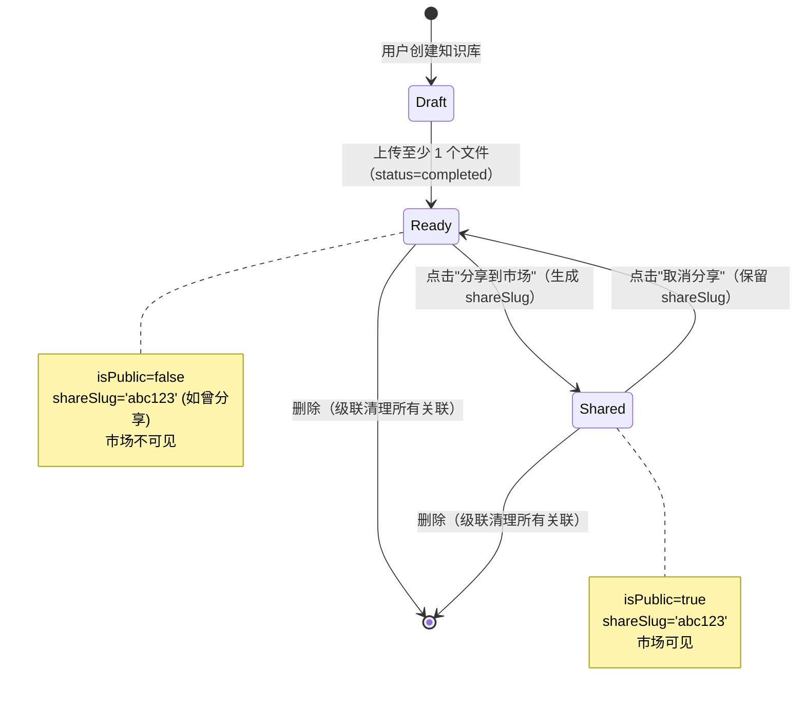
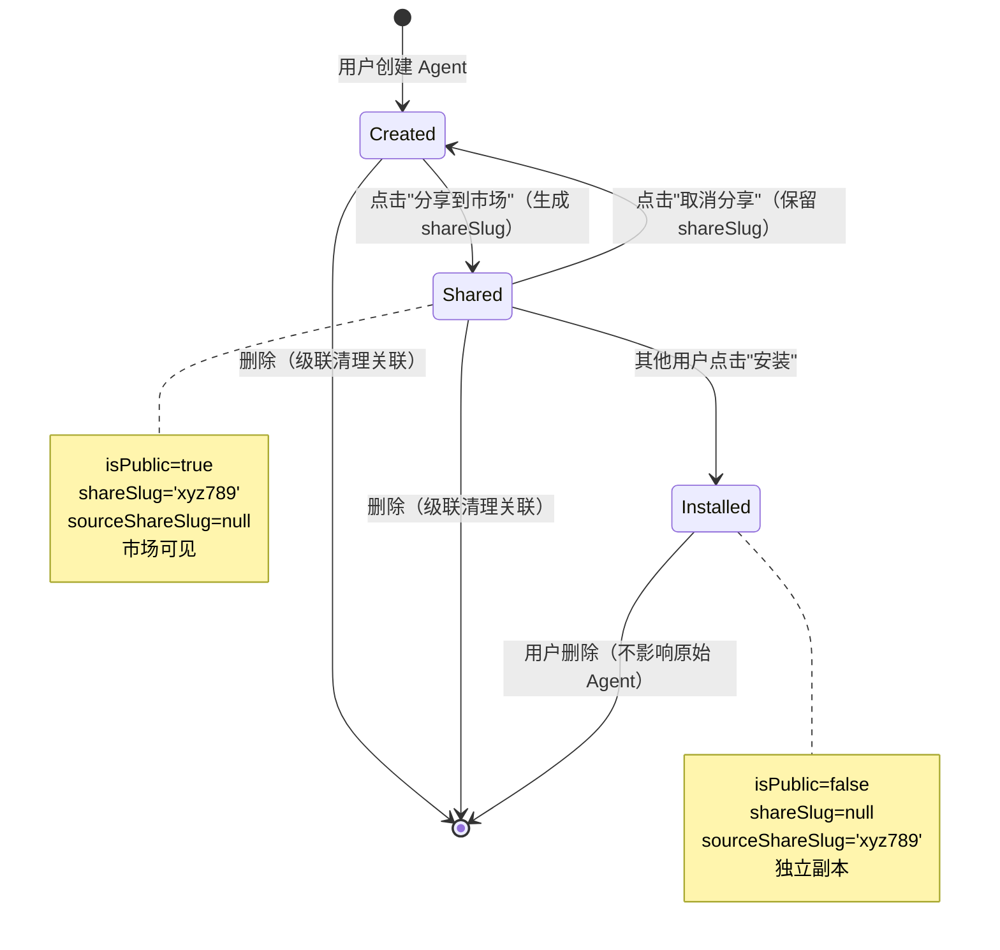

# Data Model: 知识库与 Agent 市场分享流程重构

**Feature**: 005-marketplace-sharing-refactor
**Date**: 2025-10-20
**Status**: Design

## Overview

本数据模型文档定义了市场分享功能重构所涉及的数据实体、关系和状态转换。此重构是对现有功能的优化，而非全新设计，因此重点关注：
1. 验证现有 schema 是否满足所有需求
2. 识别需要补充的约束和索引
3. 明确状态转换规则和级联行为

## Entity Definitions

### KnowledgeBase（知识库）

**用途**: 用户创建的知识集合，可分享到市场供他人使用（通过引用）

**字段** (来自 `server/db/schema.ts`):

| 字段名 | 类型 | 约束 | 说明 | 来源 |
|--------|------|------|------|------|
| id | uuid | PK | 唯一标识符 | 现有 |
| userId | uuid | FK → users.id, NOT NULL | 创建者 | 现有 |
| name | varchar | NOT NULL | 知识库名称 | 现有 |
| description | text | NULLABLE | 知识库描述 | 现有 |
| starred | boolean | DEFAULT false | 是否收藏 | 现有 |
| isPublic | boolean | DEFAULT false | 是否分享到市场 | 现有 |
| shareSlug | varchar(12) | UNIQUE, NULLABLE | 分享标识符 | 现有 |
| createdAt | timestamp | DEFAULT now() | 创建时间 | 现有 |
| updatedAt | timestamp | DEFAULT now() | 更新时间 | 现有 |

**索引**:
- `idx_knowledgeBases_user_id` (userId) - 现有
- `unique_knowledgeBases_shareSlug` (shareSlug) - 现有

**验证规则** (来自功能需求):
- FR-002: 分享前至少有一个 status='completed' 的文件
- FR-003: shareSlug 必须全局唯一（数据库约束）
- FR-004: isPublic=true 时必须有 shareSlug
- FR-006: 取消分享保留 shareSlug（设置 isPublic=false）

**状态转换**:
```
未分享 (isPublic=false, shareSlug=null)
  ↓ [用户点击"分享"] + 验证通过
已分享 (isPublic=true, shareSlug='abc123')
  ↓ [用户点击"取消分享"]
未分享 (isPublic=false, shareSlug='abc123') [保留 slug]
  ↓ [用户点击"删除"] + 确认
已删除 (级联清理所有关联)
```

**关系**:
- `hasMany` KnowledgeBaseFile (1:N, CASCADE DELETE)
- `hasMany` Embedding (1:N, CASCADE DELETE)
- `manyToMany` ChatConfig via ChatConfigKnowledgeBase (M:N)

---

### KnowledgeBaseFile（知识库文件）

**用途**: 知识库中的单个文件，用于 RAG 检索

**字段**:

| 字段名 | 类型 | 约束 | 说明 | 来源 |
|--------|------|------|------|------|
| id | uuid | PK | 唯一标识符 | 现有 |
| knowledgeBaseId | uuid | FK → knowledgeBases.id, ON DELETE CASCADE | 所属知识库 | 现有 |
| fileName | varchar | NOT NULL | 文件名 | 现有 |
| fileSize | integer | NOT NULL | 文件大小（字节） | 现有 |
| fileType | varchar | NOT NULL | MIME 类型 | 现有 |
| storagePath | varchar | NOT NULL | Supabase Storage 路径 | 现有 |
| contentText | text | NULLABLE | 提取的文本内容 | 现有 |
| status | varchar | CHECK IN ('pending', 'completed', 'failed') | 处理状态 | 现有 |
| createdAt | timestamp | DEFAULT now() | 上传时间 | 现有 |
| updatedAt | timestamp | DEFAULT now() | 更新时间 | 现有 |

**索引**:
- `idx_knowledgeBaseFiles_knowledgeBaseId` (knowledgeBaseId) - 现有

**验证规则**:
- FR-002: 知识库分享前至少有一个 status='completed' 的文件

**级联行为**:
- 知识库删除时自动删除（ON DELETE CASCADE）
- 删除前需清理 Supabase Storage 文件（应用层）

---

### Embedding（嵌入向量）

**用途**: 文件的向量表示，用于 RAG 语义搜索

**字段**:

| 字段名 | 类型 | 约束 | 说明 | 来源 |
|--------|------|------|------|------|
| id | uuid | PK | 唯一标识符 | 现有 |
| knowledgeBaseId | uuid | FK → knowledgeBases.id, ON DELETE CASCADE | 所属知识库 | 现有 |
| fileId | uuid | FK → knowledgeBaseFiles.id, ON DELETE CASCADE | 所属文件 | 现有 |
| content | text | NOT NULL | 文本片段 | 现有 |
| embedding | vector(1536) | NOT NULL | OpenAI embedding 向量 | 现有 |
| metadata | jsonb | NULLABLE | 元数据（页码、章节等） | 现有 |
| createdAt | timestamp | DEFAULT now() | 创建时间 | 现有 |

**索引**:
- `idx_embeddings_knowledgeBaseId` (knowledgeBaseId) - 现有
- HNSW 向量索引 (embedding) - 现有

**级联行为**:
- 知识库删除时自动删除（ON DELETE CASCADE）
- 文件删除时自动删除（ON DELETE CASCADE）

---

### ChatConfig（Agent 配置）

**用途**: 用户创建或从市场安装的 AI 助手配置预设

**字段**:

| 字段名 | 类型 | 约束 | 说明 | 来源 |
|--------|------|------|------|------|
| id | uuid | PK | 唯一标识符 | 现有 |
| userId | uuid | FK → users.id, NOT NULL | 所有者 | 现有 |
| name | varchar | NOT NULL | Agent 名称 | 现有 |
| defaultModel | varchar | NOT NULL | 默认 LLM 模型 | 现有 |
| systemPrompt | text | NULLABLE | 系统提示词 | 现有 |
| avatar | varchar | NULLABLE | 头像 URL | 现有 |
| webSearchEnabled | boolean | DEFAULT false | 是否启用网络搜索 | 现有 |
| isPublic | boolean | DEFAULT false | 是否分享到市场 | 现有 |
| shareSlug | varchar(12) | UNIQUE, NULLABLE | 分享标识符 | 现有 |
| sourceShareSlug | varchar(12) | NULLABLE | 安装来源标识符 | 现有 |
| createdAt | timestamp | DEFAULT now() | 创建时间 | 现有 |
| updatedAt | timestamp | DEFAULT now() | 更新时间 | 现有 |

**索引**:
- `idx_chatConfigs_user_id` (userId) - 现有
- `unique_chatConfigs_shareSlug` (shareSlug) - 现有
- `idx_chatConfigs_sourceShareSlug` (sourceShareSlug) - 现有

**验证规则**:
- FR-009: 分享前必须有 name 和 defaultModel
- FR-010: shareSlug 必须全局唯一
- FR-024: 安装时 userId !== 创建者 userId
- FR-025: 安装时检查 sourceShareSlug 防止重复

**状态转换**:
```
未分享 (isPublic=false, shareSlug=null, sourceShareSlug=null) [用户创建]
  ↓ [用户点击"分享"] + 验证通过
已分享 (isPublic=true, shareSlug='xyz789', sourceShareSlug=null)
  ↓ [其他用户点击"安装"]
已安装副本 (isPublic=false, shareSlug=null, sourceShareSlug='xyz789')

已分享 (isPublic=true, shareSlug='xyz789', sourceShareSlug=null)
  ↓ [原创者点击"取消分享"]
未分享 (isPublic=false, shareSlug='xyz789', sourceShareSlug=null) [保留 slug]
  ↓ [原创者点击"删除"] + 确认
已删除 (级联清理关联，但已安装副本不受影响)
```

**关系**:
- `manyToMany` KnowledgeBase via ChatConfigKnowledgeBase (M:N)
- `hasMany` ChatSession (1:N, 可能需要 SET NULL 或级联)

**特殊逻辑**:
- FR-027: sourceShareSlug 追溯安装来源，用于检测重复安装
- FR-045: 删除原始 Agent 不影响已安装副本（独立的 id 和 userId）

---

### ChatConfigKnowledgeBase（Agent-知识库关联）

**用途**: M:N 关系表，连接 Agent 和知识库

**字段**:

| 字段名 | 类型 | 约束 | 说明 | 来源 |
|--------|------|------|------|------|
| chatConfigId | uuid | FK → chatConfigs.id, ON DELETE CASCADE, PK | Agent ID | 现有 |
| knowledgeBaseId | uuid | FK → knowledgeBases.id, ON DELETE CASCADE, PK | 知识库 ID | 现有 |

**复合主键**: (chatConfigId, knowledgeBaseId)

**索引**:
- `idx_chatConfigKnowledgeBases_chatConfigId` (chatConfigId) - 现有
- `idx_chatConfigKnowledgeBases_knowledgeBaseId` (knowledgeBaseId) - 现有

**级联行为**:
- Agent 删除时自动删除关联（ON DELETE CASCADE）
- 知识库删除时自动删除关联（ON DELETE CASCADE）

**验证规则**:
- FR-034: 仅允许关联公开知识库（isPublic=true）或用户自己的私有知识库
- FR-028: 安装 Agent 时复制关联关系，仅关联用户可访问的知识库

---

### ChatSession（聊天会话）

**用途**: 聊天对话记录

**字段（相关部分）**:

| 字段名 | 类型 | 约束 | 说明 | 来源 |
|--------|------|------|------|------|
| id | uuid | PK | 唯一标识符 | 现有 |
| userId | uuid | FK → users.id | 会话所有者 | 现有 |
| availableKnowledgeBaseIds | jsonb | ARRAY | 当前会话可用的知识库 ID 列表 | 现有 |
| ... | ... | ... | 其他字段省略 | 现有 |

**级联行为**:
- FR-041: 知识库删除时清理 availableKnowledgeBaseIds 中的引用
- 实现方式：SQL UPDATE 过滤 JSONB 数组

---

## Schema Verification

### 现有 Schema 检查清单

✅ **已完成的字段**:
- knowledgeBases: isPublic, shareSlug
- chatConfigs: isPublic, shareSlug, sourceShareSlug, avatar
- 所有表包含 userId（多租户隔离）
- 所有表包含 createdAt, updatedAt

✅ **已完成的约束**:
- shareSlug 唯一性约束（knowledgeBases, chatConfigs）
- 外键级联删除（knowledgeBaseFiles, embeddings, chatConfigKnowledgeBases）

⚠️ **需验证的约束**（在实施阶段检查）:
1. shareSlug 唯一索引是否包含 NULLABLE 的正确处理（PostgreSQL 允许多个 NULL）
2. sourceShareSlug 索引是否存在（查询性能优化）
3. chatSessions.availableKnowledgeBaseIds 是否有 GIN 索引（JSONB 查询性能）

### 无需迁移

根据研究结果，现有 schema 已完整支持所有功能需求，**无需新增迁移脚本**。如在实施阶段发现性能问题，可考虑添加以下索引（优先级低）：

```sql
-- 可选：优化安装状态检测查询
CREATE INDEX IF NOT EXISTS idx_chatConfigs_sourceShareSlug
ON chat_configs(source_share_slug)
WHERE source_share_slug IS NOT NULL;

-- 可选：优化 chatSessions 的知识库查询
CREATE INDEX IF NOT EXISTS idx_chatSessions_availableKnowledgeBaseIds
ON chat_sessions USING GIN(available_knowledge_base_ids);
```

## State Machines

### 知识库分享状态机



### Agent 分享与安装状态机



## Cascade Delete Rules

### 知识库删除级联（FR-037 至 FR-042）

**触发条件**: 用户点击"删除"按钮并确认

**级联顺序**:
1. **数据库级联**（自动）:
   - knowledgeBaseFiles (ON DELETE CASCADE)
   - embeddings (ON DELETE CASCADE)
   - chatConfigKnowledgeBases (ON DELETE CASCADE)

2. **应用层清理**（手动）:
   - Supabase Storage 文件删除（批量操作）
   - chatSessions.availableKnowledgeBaseIds JSONB 数组过滤

**SQL 示例**（应用层清理）:
```sql
-- 清理 chatSessions 的 JSONB 数组引用
UPDATE chat_sessions
SET available_knowledge_base_ids = (
  SELECT jsonb_agg(elem)
  FROM jsonb_array_elements(available_knowledge_base_ids) AS elem
  WHERE elem::text != '"[知识库UUID]"'
)
WHERE available_knowledge_base_ids @> '[  "[知识库UUID]"]'::jsonb;
```

**事务保证**:
```typescript
// 使用 Drizzle 事务确保原子性
await db.transaction(async (tx) => {
  // 1. 获取文件列表（用于存储清理）
  const files = await tx.select()...;

  // 2. 删除数据库记录（自动级联）
  await tx.delete(knowledgeBases).where(eq(knowledgeBases.id, id));

  // 3. 清理 chatSessions JSONB
  await tx.execute(sql`UPDATE chat_sessions...`);

  // 4. 清理外部存储（异步，事务外）
  // 注意：事务提交后执行，失败不影响事务
});

// 事务外清理存储
await Promise.allSettled(files.map(f => supabase.storage.delete(f.path)));
```

### Agent 删除级联（FR-043 至 FR-047）

**触发条件**: 用户点击"删除"按钮并确认

**级联顺序**:
1. **数据库级联**（自动）:
   - chatConfigKnowledgeBases (ON DELETE CASCADE)

2. **特殊处理**:
   - 已安装副本（sourceShareSlug 指向此 Agent）**不受影响**（独立记录）

**无需事务**：Agent 删除仅涉及数据库操作，由外键约束自动级联。

## Data Integrity Rules

### 分享前验证（FR-002, FR-009）

**知识库分享**:
```sql
-- 验证至少有一个完成的文件
SELECT COUNT(*) > 0 FROM knowledge_base_files
WHERE knowledge_base_id = ? AND status = 'completed';
```

**Agent 分享**:
```typescript
// 验证必填字段（Zod 验证器）
const shareAgentSchema = z.object({
  id: z.string().uuid(),
  // 要求已存在的记录必须有 name 和 defaultModel
});
```

### 安装防护（FR-024, FR-025）

**阻止自我安装**:
```sql
SELECT user_id FROM chat_configs
WHERE share_slug = ? AND is_public = true;
-- 如果 user_id == 当前用户，返回错误
```

**阻止重复安装**:
```sql
SELECT COUNT(*) FROM chat_configs
WHERE user_id = ? AND source_share_slug = ?;
-- 如果 COUNT > 0，返回错误
```

### ShareSlug 唯一性（FR-048, FR-049）

**生成策略**:
```typescript
import { nanoid } from 'nanoid';

function generateShareSlug(): string {
  return nanoid(10); // ~1.15 quadrillion 组合
}

async function generateUniqueShareSlug(
  table: 'knowledgeBases' | 'chatConfigs',
  maxRetries = 3
): Promise<string> {
  for (let i = 0; i < maxRetries; i++) {
    const slug = generateShareSlug();
    const exists = await checkSlugExists(table, slug);
    if (!exists) return slug;
  }
  throw new Error('Failed to generate unique slug after retries');
}
```

**冲突处理**:
- 优先使用 `generateUniqueShareSlug()`（推荐）
- 如遇数据库唯一约束错误，返回 409 Conflict 给客户端
- 客户端重试或提示用户

## Access Control Rules

### 多租户隔离（原则 V）

**私有资源访问**:
```sql
-- 查询用户自己的知识库
SELECT * FROM knowledge_bases WHERE user_id = ?;

-- 查询用户自己的 Agent
SELECT * FROM chat_configs WHERE user_id = ?;
```

**公开资源访问**:
```sql
-- 市场浏览（无需认证）
SELECT * FROM knowledge_bases WHERE is_public = true;
SELECT * FROM chat_configs WHERE is_public = true;

-- 详情查看（通过 shareSlug）
SELECT * FROM knowledge_bases WHERE share_slug = ? AND is_public = true;
SELECT * FROM chat_configs WHERE share_slug = ? AND is_public = true;
```

**Agent 关联知识库验证**（FR-034）:
```sql
-- 用户可关联的知识库：自己的 + 公开的
SELECT * FROM knowledge_bases
WHERE user_id = ? OR is_public = true;
```

## Performance Considerations

### 查询优化建议

1. **市场列表分页**:
   ```sql
   SELECT * FROM knowledge_bases
   WHERE is_public = true
   ORDER BY created_at DESC
   LIMIT 20 OFFSET ?;
   ```
   - 使用 `created_at` 索引
   - 每页 20 条记录

2. **搜索查询**:
   ```sql
   SELECT * FROM chat_configs
   WHERE is_public = true
   AND (name ILIKE ? OR system_prompt ILIKE ?)
   LIMIT 20;
   ```
   - 考虑 GIN 索引（PostgreSQL 全文搜索）
   - 防抖延迟 300ms

3. **安装状态检测**:
   ```sql
   SELECT EXISTS(
     SELECT 1 FROM chat_configs
     WHERE user_id = ? AND source_share_slug = ?
   );
   ```
   - 使用 EXISTS 代替 COUNT（性能更好）
   - sourceShareSlug 索引

### 缓存策略

**TanStack Query 配置**:
- 市场列表: `staleTime: 2 * 60 * 1000` (2 分钟)
- 详情页: `staleTime: 5 * 60 * 1000` (5 分钟)
- 用户资源列表: `staleTime: 1 * 60 * 1000` (1 分钟)

**缓存失效触发**:
- 分享/取消分享: 失效 `knowledgeBaseKeys.all` 和 `marketplaceKeys.knowledgeBases()`
- 安装 Agent: 失效 `chatConfigKeys.lists()`
- 删除资源: 失效对应的 detail 和 list 缓存

## Summary

✅ **现有 schema 完整性**: 所有必需字段和约束已存在，无需迁移
✅ **级联逻辑清晰**: 数据库级联 + 应用层清理，事务保证原子性
✅ **状态转换明确**: 分享/取消分享/安装/删除的状态机清晰
✅ **访问控制严格**: 多租户隔离 + 公开资源访问规则
⚠️ **待优化项**: ShareSlug 生成使用 `generateUniqueShareSlug()`，添加性能索引

**实施阶段行动项**:
1. 验证现有索引完整性（sourceShareSlug, availableKnowledgeBaseIds）
2. 在分享端点使用 `generateUniqueShareSlug()` 代替 `generateShareSlug()`
3. 添加 409 Conflict 错误处理和客户端重试逻辑
4. 性能测试市场列表查询（1000+ 记录场景）
