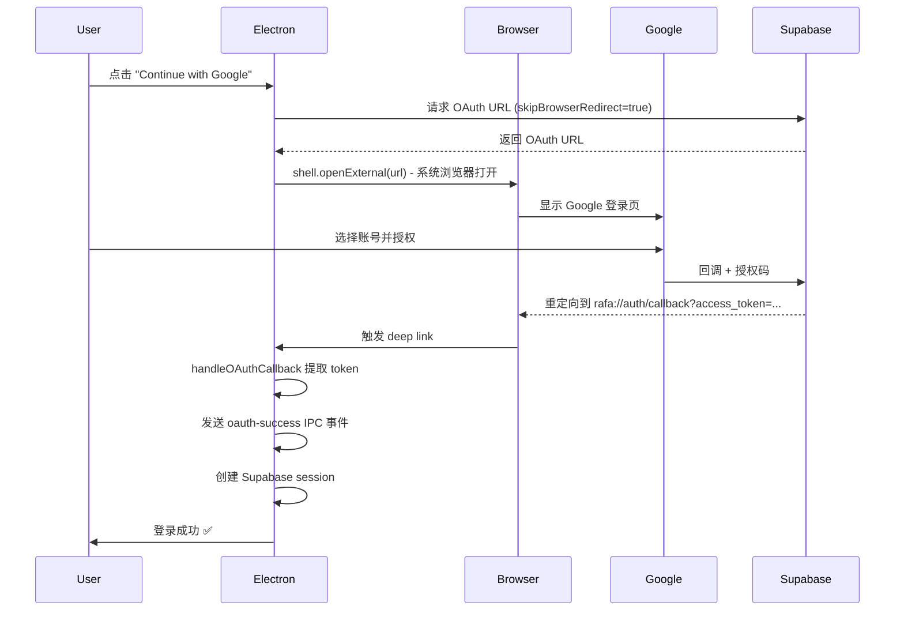

# OAuth 在系统浏览器打开修复

## 🐛 问题描述

**症状**:
- 打包后的 Electron 应用点击 "Continue with Google"
- OAuth 页面在 Electron 窗口内打开
- 选择 Google 账号后没有任何反应
- 控制台没有日志

**根本原因**:
- Supabase `signInWithOAuth` 默认在当前窗口打开 OAuth 页面
- Electron 窗口内的 Google OAuth 不会触发重定向回调
- 需要在**系统默认浏览器**中打开 OAuth 流程

## ✅ 解决方案

### 关键修改

#### 1. 使用 `skipBrowserRedirect` 选项

```typescript
// client/src/renderer/src/lib/auth.ts

const { data, error } = await client.auth.signInWithOAuth({
  provider: 'google',
  options: {
    redirectTo,
    skipBrowserRedirect: true, // ← 关键：阻止自动重定向
    queryParams: {
      prompt: 'select_account',
    },
  },
})
```

#### 2. 手动在系统浏览器打开

```typescript
// 获取 OAuth URL
if (data?.url) {
  // 使用 Electron shell.openExternal 在系统浏览器打开
  if (window.electron?.shell) {
    await window.electron.shell.openExternal(data.url)
  } else {
    // Web 环境回退
    window.location.href = data.url
  }
}
```

#### 3. 暴露 shell API 到渲染进程

**preload.ts**:
```typescript
import { shell } from 'electron'

contextBridge.exposeInMainWorld('electron', {
  // ...其他 API
  shell: {
    openExternal(url: string) {
      return shell.openExternal(url)
    },
  },
})
```

**global.d.ts**:
```typescript
interface Window {
  electron: {
    // ...其他 API
    shell: {
      openExternal: (url: string) => Promise<void>
    }
  }
}
```

## 🔄 OAuth 流程

### 修复后的流程



## 📁 修改的文件

### 1. [client/src/renderer/src/lib/auth.ts](file:///Users/wei/Coding/rafa/client/src/renderer/src/lib/auth.ts#L19-L58)

**修改内容**:
- ✅ 添加 `skipBrowserRedirect: true`
- ✅ 获取 `data.url` 而不是自动重定向
- ✅ 使用 `window.electron.shell.openExternal()` 打开系统浏览器
- ✅ 添加错误处理和日志

### 2. [client/src/preload/index.ts](file:///Users/wei/Coding/rafa/client/src/preload/index.ts#L1-L32)

**修改内容**:
- ✅ 导入 `shell` from electron
- ✅ 暴露 `shell.openExternal` 到渲染进程

### 3. [client/src/renderer/src/global.d.ts](file:///Users/wei/Coding/rafa/client/src/renderer/src/global.d.ts#L134-L145)

**修改内容**:
- ✅ 添加 `shell` 类型定义到 `Window.electron`

## 🧪 测试步骤

### 开发环境测试

```bash
npm run dev
```

**预期行为**:
1. 点击 "Continue with Google"
2. **系统默认浏览器**自动打开 Google 登录页（不是在 Electron 窗口内）
3. 选择 Google 账号并授权
4. 浏览器重定向到 `http://localhost:5173`
5. Electron 应用自动登录成功

### 生产环境测试

```bash
# 构建应用
npm run client:build

# 安装 .dmg 并打开应用
```

**预期行为**:
1. 点击 "Continue with Google"
2. **系统默认浏览器**自动打开 Google 登录页
3. 选择 Google 账号并授权
4. 浏览器重定向到 `rafa://auth/callback?access_token=...`
5. Electron 应用自动聚焦并登录成功

### 验证日志

打开 DevTools 查看控制台：

```
[OAuth] Opening OAuth URL in system browser: https://accounts.google.com/...
[Deep Link] Received URL (macOS): rafa://auth/callback?access_token=...
[OAuth] Tokens received, sending to renderer...
[OAuth] Received tokens from main process
[OAuth] Session created, navigating to home...
[OAuth] Session created successfully: user@example.com
```

## 🐛 故障排查

### 问题 1: 浏览器没有自动打开

**检查**:
```bash
# 确保 preload 脚本已重新编译
npm run build
```

**验证**:
```javascript
// 在 DevTools Console 测试
console.log(window.electron.shell) // 应该显示 { openExternal: f }
```

### 问题 2: Deep link 不工作

**检查协议注册**:
```bash
# macOS
/System/Library/Frameworks/CoreServices.framework/Versions/A/Frameworks/LaunchServices.framework/Versions/A/Support/lsregister -dump | grep rafa
```

**重新注册**:
```bash
# 重新安装 .dmg
# 或重置 Launch Services
/System/Library/Frameworks/CoreServices.framework/Versions/A/Frameworks/LaunchServices.framework/Versions/A/Support/lsregister -kill -r -domain local -domain system -domain user
```

### 问题 3: Supabase 配置错误

**确认 Redirect URLs**:
- ✅ 开发环境: `http://localhost:5173`
- ✅ 生产环境: `rafa://auth/callback`

访问: https://supabase.com/dashboard
路径: Authentication → URL Configuration → Redirect URLs

## 🔐 安全注意事项

### shell.openExternal 安全性

✅ **安全**:
- 只打开 Supabase 返回的 OAuth URL
- URL 来自受信任的 Supabase API
- 不接受用户输入的 URL

❌ **不安全**（避免）:
```typescript
// 危险：不要直接使用用户输入
const userUrl = getUserInput()
shell.openExternal(userUrl) // ← 可能被利用
```

### 最佳实践

1. **验证 URL 来源**:
   ```typescript
   if (data?.url && data.url.startsWith('https://')) {
     await window.electron.shell.openExternal(data.url)
   }
   ```

2. **限制允许的域名**（可选）:
   ```typescript
   const allowedDomains = ['accounts.google.com', 'supabase.co']
   const url = new URL(data.url)
   if (allowedDomains.some(domain => url.hostname.endsWith(domain))) {
     await window.electron.shell.openExternal(data.url)
   }
   ```

## 📚 参考资源

### Supabase 文档
- [signInWithOAuth API](https://supabase.com/docs/reference/javascript/auth-signinwithoauth)
- `skipBrowserRedirect` 选项用于自定义重定向逻辑

### Electron 文档
- [shell.openExternal](https://www.electronjs.org/docs/latest/api/shell#shellopenexternalurl-options)
- 在系统默认浏览器中打开 URL

### 最佳实践
- [Google OAuth for Desktop Apps](https://developers.google.com/identity/protocols/oauth2/native-app)
- RFC 8252: OAuth 2.0 for Native Apps

## ✅ 检查清单

- [x] 修改 `auth.ts` 添加 `skipBrowserRedirect: true`
- [x] 添加 `shell.openExternal` 调用
- [x] 在 `preload.ts` 暴露 shell API
- [x] 在 `global.d.ts` 添加类型定义
- [x] 通过 TypeScript 类型检查
- [ ] 开发环境测试（localhost）
- [ ] 生产环境测试（打包后）
- [ ] 验证 deep link 回调
- [ ] 验证 session 创建

---

**创建日期**: 2025-10-28
**状态**: ✅ 已修复
**影响**: 解决了 Electron 打包后 Google OAuth 无法登录的问题
